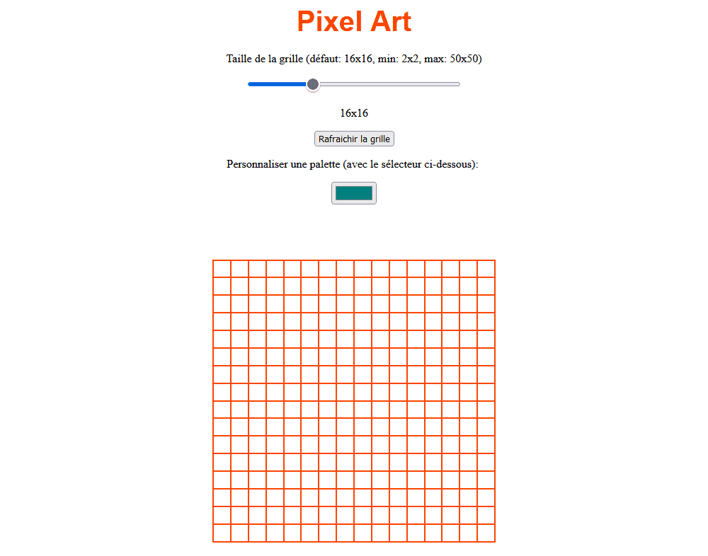
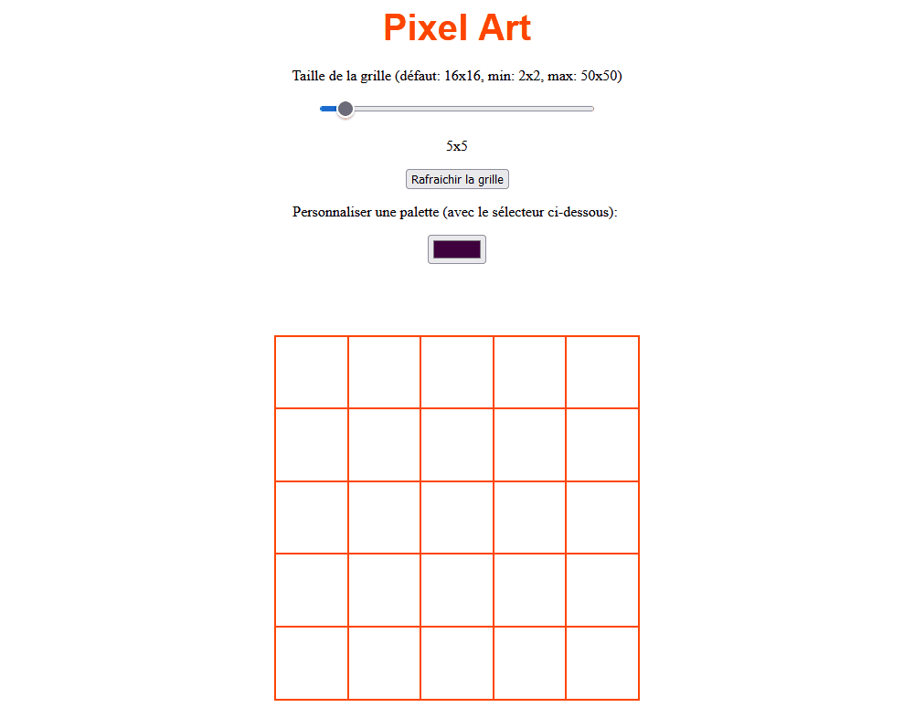

# Page web interactive; grille à colorier

**Objectif:** maitriser les fondements des langages web; développer un fichier HTML avec ses balises; ajouter le langage CSS dans les balises du langage HTML, ajouter le langage CSS dans une balise `<style>` à même le fichier HTML ou comme fichier CSS associé au fichier HTML, employer les *tag* vs. les *class*, employer les éléments CSS avancés pour s'adapter à l'écran (*Media Queries*), les *container*, les *flexbox*, les *wrapper*, les *alignment*, développer des *navbar* flexibles; ajouter du langage JavaScript; travailler avec node.js à la console, avec Visual Studio et directement dans un navigateur; maitriser le DOM, les fonctions, les sorties en console ou à l'écran, les événements et plus.

| Projet intégrateur  |   |
|:---|:---|
|  |   |
